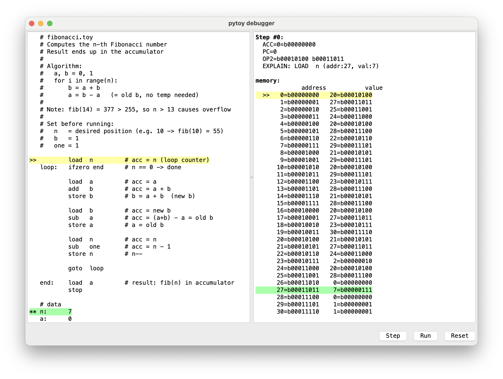

# pytoy

Assembler and simulator for the [Toy CPU](https://github.com/freedosproject/toycpu) in Python.

The Toy CPU is a minimal 8-bit processor with 256 bytes of memory, one accumulator, and a program counter. Originally built as a FreeDOS learning tool with a switch-based interface (like an Altair 8800) — pytoy replaces the binary input with readable assembly.

## Architecture

- **256 bytes RAM** — code and data share the same address space
- **Accumulator** — the only arithmetic register, 8-bit (0–255)
- **Program Counter (PC)** — points to the current instruction

### Instruction Set

| Mnemonic | Opcode | Bytes | Description |
|----------|--------|-------|-------------|
| `stop`   | 0x00   | 1     | Halt the program |
| `right`  | 0x01   | 1     | ACC >> 1 (shift right) |
| `left`   | 0x02   | 1     | ACC << 1 (shift left) |
| `not`    | 0x0F   | 1     | ACC = ~ACC (bitwise NOT) |
| `nop`    | 0x80   | 1     | No operation |
| `and`    | 0x11   | 2     | ACC = ACC & mem[addr] |
| `or`     | 0x12   | 2     | ACC = ACC \| mem[addr] |
| `xor`    | 0x13   | 2     | ACC = ACC ^ mem[addr] |
| `load`   | 0x14   | 2     | ACC = mem[addr] |
| `store`  | 0x15   | 2     | mem[addr] = ACC |
| `add`    | 0x16   | 2     | ACC = ACC + mem[addr] |
| `sub`    | 0x17   | 2     | ACC = ACC - mem[addr] |
| `goto`   | 0x18   | 2     | PC = addr |
| `ifzero` | 0x19   | 2     | if ACC == 0: PC = addr |

1-byte vs. 2-byte is determined by bit 4 (FETCH_BIT). Unrecognized opcodes act as NOP.

## Usage

```bash
python3 pytoy.py prog.toy
```

By default, pytoy runs step-by-step with full verbose output. Press Enter to advance each instruction. Use `python3 pytoy.py -h` for all options.

## GUI

The `-g` / `--gui` flag opens a PySide6-based graphical interface with:

- Source code panel with highlighted current instruction (yellow) and referenced memory (green)
- Memory panel showing addresses and values in binary
- Step, Run, and Reset controls (also via Space, R, Escape)
- Click any line to highlight it (orange) on both panels

PySide6 is only required for the GUI — the command-line mode works without it.

```bash
pip install PySide6   # only needed for --gui
python3 pytoy.py examples/fibonacci.toy --gui
```

## Assembly Syntax

```
# comments with #
label:  load  var       # labels for jump targets and variables
        add   other
        goto  label

# data at the end
var:    42              # decimal
flags:  0b00001111      # binary
mask:   0xFF            # hex
```

## Examples

See [`examples/`](examples/) — e.g. `fibonacci.toy` computes the n-th Fibonacci number.

```bash
python3 pytoy.py examples/fibonacci.toy
```

## Credits

Based on the [Toy CPU](https://github.com/freedosproject/toycpu) by Jim Hall (FreeDOS Project).
